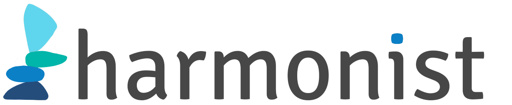

## Informatics Solutions for Data Harmonization in Global Research Networks

Global observational research networks can provide data for important epidemiologic analyses. Effective research in these networks depends on high quality data, adherence to a common data model, as well as timely communication within the network about research requests and data sharing. The Harmonist team at Vanderbilt University is creating a suite of software solutions to streamline these processes and facilitate meaningful research. Funding provided by the NIH (US NIAID grant R24 AI124872).

### Harmonist Tools

Harmonist software resources fall in three categories

- [Harmonist Data Toolkit](pages/toolkit.md): A web-based data quality checking, report generation, and dataset transfer application
- [Harmonist Hub](pages/hub.md): An online project management and collaboration portal
- [REDCap External Modules](pages/externalmodules.md): Publicly available modules used in Harmonist applications

### Resources
- [Harmonist Presentations and Tutorials](presentations/overview.md)
- [Harmonist Github Repositories](code.md)
- [Contact Harmonist Team](pages/team.md)

